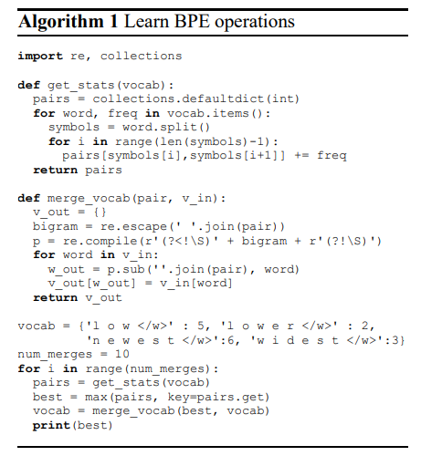

# 1.3.1 BPE

[arXiv:1508.07909v5 \[cs.CL\] 10 Jun 2016](https://arxiv.org/pdf/1508.07909.pdf)

这篇论文的核心内容是关于如何使用神经机器翻译（Neural Machine Translation, NMT）模型来处理罕见词汇的翻译问题。传统的NMT模型通常使用固定词汇表，但实际翻译任务是开放词汇的，即需要处理不在词汇表中的单词。以往的研究通过回退到字典来解决这个问题。

本文提出使用子词单元（subword units）对罕见和未知词汇进行编码，从而实现开放词汇的翻译。

存在的问题

"Back-off to a dictionary look-up" 是一种在机器翻译和其他自然语言处理任务中处理未知词汇（OOV，Out-Of-Vocabulary）的策略。

具体来说，"back-off" 是一种退而求其次的方法。在翻译模型中，当直接的翻译方法失败或不可靠时（例如，因为单词太罕见或在训练集中没有出现过），模型会转向使用一个预先定义的字典来进行单词的查找和翻译。

这种方法的步骤通常包括：

1. **尝试直接翻译**：模型首先尝试根据学习到的知识和模式来直接翻译遇到的单词。
2. **检测OOV**：如果模型发现它无法直接翻译某个单词，或者认为直接翻译的不确定性太高，它会将这个单词标记为OOV。
3. **使用字典查找**：模型接下来会查询一个外部字典。这个字典可能包括常见的专有名词、地名、人名等，或者是特定领域的术语。
4. **回退翻译**：如果字典中有该单词的条目，模型就会使用这个条目来生成翻译。如果没有找到条目，模型可能会采用一些启发式方法来生成一个近似的翻译，或者简单地将原单词复制到翻译中。

back-off方法并没有有效解决OOV问题，主要基于以下几个原因：

1. **有限的覆盖率**：Back-off字典通常包含有限的条目，特别是对于罕见词汇或新出现的词汇，字典可能没有相应的翻译或表示。
2. **缺乏上下文感知**：Back-off字典通常是基于静态映射的，它不考虑单词在特定上下文中的含义。
3. **无法生成新词汇**：传统的back-off方法主要用于查找和复制已知的翻译，而不是生成新的翻译。
4. **依赖于外部资源**：Back-off方法依赖于外部字典，这可能导致模型的灵活性和可移植性受限。
5. **缺乏泛化能力**：Back-off方法可能无法很好地泛化到新的数据集或任务上。

BPE

字节对编码（Byte Pair Encoding, BPE）是一种简单的数据压缩技术，最初用于合并频繁出现的字节对以减少数据的大小， 在NMT中，BPE被用于单词分割，以便将单词表示为一系列子词单元，它允许模型使用一个固定大小的词汇表来表示开放词汇，从而能够处理在训练数据中未出现过的单词。

假设

讨论了哪些类型的单词在翻译时可能是透明的，即这些单词可以通过已知的子词单元进行翻译

1. **命名实体（Named Entities）**：

* 在共享字母表的语言之间，人名、地名等命名实体可以直接从源语言复制到目标语言文本中。
* 如果字母表不同，可能需要进行转录或音译。

1. **同源词和借词（Cognates and Loanwords）**：

* 具有共同起源的同源词和借词在不同语言间可能有规律的变化，因此基于字符级的翻译规则就足够了。

1. **形态复杂的词（Morphologically Complex Words）**：

* 包含多个语素的词汇，例如通过复合、前缀、后缀或屈折变化形成的词汇，可以通过分别翻译这些语素来进行翻译。
* 例如，英语中的“solar system”（太阳系）可以分解为“solar”（太阳的）和“system”（系统），并在翻译成其他语言时保持这种分解。

BPE这种方法的有效性基于以下假设：

1. **子词单元的适当性**：通过将罕见词汇分割为更小的、语义上有意义的子词单元，模型能够更好地理解每个单元的含义，并在翻译时保持这些单元的语义透明度。
2. **学习透明翻译的能力**：神经网络能够通过训练数据学习如何将这些子词单元映射到目标语言中的对应单元，从而实现准确的翻译。
3. **泛化能力**：一旦模型学会了如何翻译这些子词单元，它就能够将这些知识应用到新的、未见过的单词上，通过组合已知的子词单元来生成翻译。

实现步骤

1. **初始化词汇表**：

* 将词汇表初始化为包含所有可能的单字符（例如，字母、数字和标点符号）。
* 为每个单词添加一个特殊的结束符号，以便于在翻译后恢复原始的单词分词。

1. **统计字符对频率**：

* 对训练数据中的单词进行遍历，统计每个单词内部的连续字符对（或更长的字符序列）的出现频率。

1. **合并最频繁的字符对**：

* 找出出现频率最高的字符对，并将其合并为一个新的符号。
* 这个新符号成为词汇表中的一个新条目，代表原始字符对中的子词单元。

1. **迭代过程**：

* 重复步骤2和3，直到达到预设的合并次数或者词汇表的大小不再增加。
* 每次迭代都会生成新的子词单元，并更新词汇表。

1. **构建分割规则**：

* 根据合并操作历史记录，构建一个分割规则，用于将单词分割为子词单元序列。
* 这个规则将指导模型如何将新的、未见过的单词分解为已知的子词单元。

1. **应用分割规则**：

* 在翻译过程中，对于每个单词，首先将其分割为单个字符。
* 然后，根据BPE生成的分割规则，逐步将字符合并成子词单元。
* 这个过程将持续进行，直到所有的字符都被合并成词汇表中的子词单元。

1. **处理未知词汇**：

* 如果在测试数据中遇到训练时未见过的单词，使用BPE分割规则将其分解为子词单元。
* 由于这些子词单元已经在训练过程中学习过，模型可以利用这些子词单元的表示来生成翻译。

<figure><figcaption></figcaption></figure>

BPE维护两个表

1. **合并操作表（Merge Operations Table）**：这个表记录了BPE算法在迭代过程中所执行的所有合并操作。其中包含了被合并的两个符号，以及合并后生成的新符号。
2. **分割表（Segmentation Table）** 或 **BPE 词汇表（BPE Vocabulary）**：这个表是最终生成的，包含了所有的子词单元，即合并操作的结果。这个词汇表用于在翻译过程中将单词分割为子词单元序列。

无需shortlist

在传统的神经机器翻译模型中，通常会维护一个短列表，其中包含了最常见的词汇，这些词汇在翻译时不会被分割，而是直接作为完整的单元进行处理。这种方法的目的是为了提高翻译效率和处理高频词汇的准确性。然而，BPE算法通过合并频繁出现的字符对来动态地扩展词汇表，这意味着即使是高频词汇也会被分割成更小的子词单元。

由于BPE算法能够生成一个固定大小的词汇表，并且这个词汇表包含了所有在训练数据中出现过的子词单元，因此在使用BPE算法时，不需要额外维护一个短列表（shortlist）来处理高频词汇。因此，使用BPE算法的神经机器翻译模型简化了模型的设计。

独立BPE和联合BPE

在翻译任务中，独立BPE（Independent BPE）和联合BPE（Joint BPE）是两种不同的子词分割策略，它们各自有不同的优缺点：

独立BPE（Independent BPE）

独立BPE是指对源语言和目标语言的词汇表分别应用BPE算法，生成两个独立的子词分割规则。

**优点**:

* **紧凑性**：独立BPE倾向于生成更紧凑的词汇表，因为它只考虑了单一语言中单词的频率。
* **语言特定优化**：可以针对每种语言单独优化合并策略，可能在某些情况下提供更好的性能。
* **简单性**：实现起来相对简单，因为不需要跨语言的合并规则。

**缺点**:

* **分割不一致性**：可能会导致同一单词在源语言和目标语言中被分割成不同的子词单元，这可能会给模型学习跨语言的对应关系带来困难。
* **泛化能力**：可能不如联合BPE在处理跨语言新词或罕见词时的泛化能力强。

联合BPE（Joint BPE）

联合BPE是指同时考虑源语言和目标语言的词汇表，生成一个统一的子词分割规则，适用于两种语言。

**优点**:

* **一致性**：由于使用了统一的分割规则，可以确保同一单词在源语言和目标语言中被分割成相同的子词单元，有助于模型学习更准确的跨语言对应关系。
* **更好的泛化**：联合BPE可能在处理跨语言新词或罕见词时提供更好的泛化能力，因为模型可以利用两种语言共有的子词单元知识。
* **减少语言依赖**：联合BPE生成的子词单元在一定程度上减少了对特定语言的依赖，可能在多语言翻译系统中更为有效。

**缺点**:

* **词汇表大小**：联合BPE可能导致更大的词汇表，因为它合并了两种语言中的所有可能子词单元。
* **复杂性**：实现起来可能更复杂，需要同时处理两种语言的数据，并确保合并策略对两种语言都有效。
* **效率问题**：由于词汇表更大，可能需要更多的计算资源和存储空间。

在选择使用独立BPE还是联合BPE时，需要根据具体的翻译任务和目标语言的特点来决定。例如，如果两种语言在书写系统和词汇构成上有较大差异，独立BPE可能更合适；而如果需要模型具有良好的跨语言泛化能力，或者在多语言环境中工作，联合BPE可能是更好的选择。

联合BPE的实现

1. **合并词汇表**：首先，将源语言和目标语言的词汇表合并为一个单一的词汇表。
2. **应用BPE算法**：接着，对这个合并后的词汇表应用BPE算法。
3. **分割单词**：使用通过联合BPE算法生成的合并操作列表来分割源语言和目标语言中的单词。
4. **处理不同字符集**：如果源语言和目标语言使用不同的字符集（例如，一种语言使用拉丁字母，另一种使用西里尔字母），可以通过将目标语言的词汇表转换为源语言字符集的方式来学习联合BPE。这通常涉及到字符级别的转写或映射。

评估

在第四部分中，作者旨在通过实验回答以下问题：

* 通过子词单元表示罕见和未见词汇是否能提高神经机器翻译的质量？
* 哪种子词单元分割方法在词汇表大小、文本大小和翻译质量方面表现最好？

作者在WMT 2015的英德和英俄翻译任务上进行了实验。他们使用了以下指标来评估翻译性能：

* BLEU (Bilingual Evaluation Understudy)：一个广泛使用的自动评估指标，用于比较机器翻译输出与参考翻译的相似度。
* CHRF3 (Character-based n-gram F3 score)：一个基于字符级别的评估指标，与人类评判有很好的相关性，特别适用于评估非英语的翻译质量。
* Unigram F1：用于评估罕见和未见词汇的翻译质量，通过计算剪切的一元精度和召回率的调和平均数。

实验结果表明，子词模型在处理罕见和未见词汇方面优于基于字典的基线模型，并且在总体的翻译质量上也有所提升。

分析

Unigram Accuracy

<figure><figcaption></figcaption></figure>

* **Baseline系统（WDict）**：这个系统使用了一个回退字典来处理OOV词汇，通常通过复制源文本中的单词来处理。这个系统的unigram F1分数在OOV词汇上有所提高，尤其是在名字这类命名实体上。
* **子词单元系统**：使用了基于字符的bigram（C2-50k）和BPE算法（BPE-60k和BPE-J90k）的系统在处理罕见和未见词汇上表现更好。特别是使用BPE算法的系统，在整体的unigram F1分数和罕见词汇的处理上都有所提升。

<figure><figcaption></figcaption></figure>

* **Baseline系统（WDict）**：在俄语中，由于无法直接复制英文名字，这个系统在OOV词汇上的表现不如英语到德语的任务。
* **子词单元系统**：使用BPE算法的系统在处理OOV词汇时，无论是在精度还是召回率上都有所提升，尤其是使用联合BPE（BPE-J90k）的系统。
